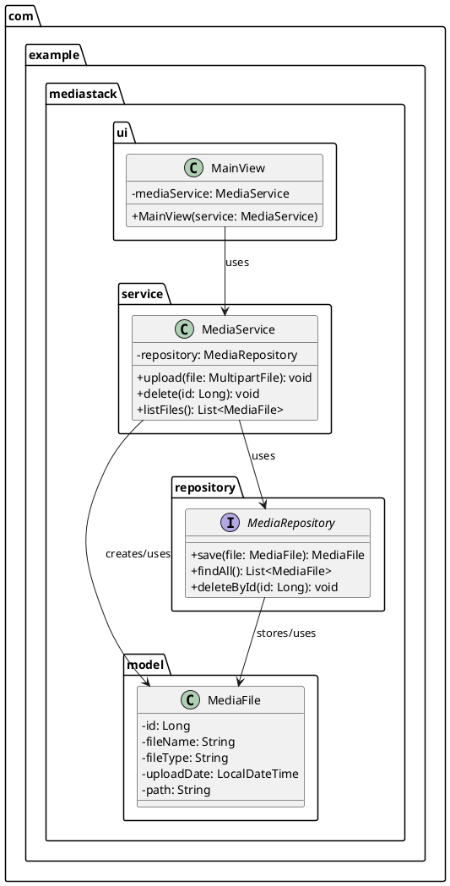

# 📦 MediaStack

**MediaStack** is a personal web application for managing and displaying your media content.  
It allows uploading, storing, viewing, and deleting **images**, **videos**, and **PDFs** through an intuitive user interface written entirely in Java (Vaadin).  
Data is managed locally using an SQLite database, while the actual files are stored in the local file system.

---

## 📚 Overview

- [Features](#-features)
- [Local Setup](#-local-setup)
- [Tech Stack](#-tech-stack)
- [Project Structure](#-project-structure-v-01)
- [Prospect](#-prospect)
- [Screenshots](#-screenshots)

---

## 🚀 Features

- 🔼 Upload images, videos, and PDF files
- 📂 Overview of all stored media
- 🖼️ Display images directly in the browser
- 📄 Embed PDF files in the browser
- 🎬 Play videos
- 🗑️ Delete files via the UI
- 🏷️ Store metadata such as filename, type, and upload timestamp

Here’s how to update your `README.md` to reflect the Gradle-based build and installer process with configurable installer types:

---

## 🧪 Local Setup

### Prerequisites

- Java 23+
- Gradle (or use the included Gradle Wrapper: `./gradlew`)
- (Optional: IDE like IntelliJ IDEA)

### ▶Run the project

```bash
git clone https://github.com/your-user/mediastack.git
cd mediastack
./gradlew bootRun
```

The application will be available at [http://localhost:8080](http://localhost:8080).

---

## ⚙️ Tech Stack

| Technology  | Purpose                            |
|-------------|-------------------------------------|
| Java 23     | Programming language                |
| Vaadin 24   | UI framework (Java-based)           |
| Spring Boot | Backend framework & configuration   |
| SQLite      | Database for metadata               |
| File-System | Storage for media files             |

---

## 📁 Project Structure (v 0.1)

### Folder Structure

```text
mediastack/
├── src/
│   ├── main/
│   │   ├── java/com/example/mediastack/
│   │   │   ├── ui/       
│   │   │   ├── model/        
│   │   │   ├── repository/    
│   │   │   └── service/
```

### Class Diagram




### Planning

Building the fundermental features while keeping the code clean and maintainable. Is the main focus of this version.

Furthermore I wanna ensure that the application is easy to extend in the future, so I will try to follow best practices and design patterns.

I wanna mention that I try for education purposes to code with the test driven development (TDD) approach, so a little disclaimer at this point that the code may contain some bugs.

#### Features

- [x] Upload images, videos, and PDF files
- [x] Overview of all stored media
- [ ] Display images directly in the browser
- [ ] Embed PDF files in the browser
- [ ] Play videos
- [x] Delete files via the UI
- [x]️ Store metadata such as filename, type, and upload timestamp

#### Expected timeframe

Total timespan: 2025-05-29 -> 2023-06-12 (two Weeks)

**Week 1:**

1. 29.05 - Time Planning and Project Setup (1h)
   - Create a new Spring Boot project with Vaadin
   - Set up SQLite database connection
   - Create initial folder structure and class diagram
   - Create initial README.md file with project description and TODOs
2. 30.05 - Implement test cases for the MediaFile model, Implement MediaFile model and repository, create SQLite database (2h)
   - Change Java version to 23 because of Vaadin 24 and Java 17 makes no sense for me because I do not need to refactor anythin up
   - Create Tests for MediaFileModel, MediaFileModelBuilder and MediaFileDirector because I wanna use the builder pattern for my Model with multiple properties and Constructor
   - Add lombok to the project for easier model creation and reduce boilerplate code
   - Create MediaFile model with properties like id, name, fileType, uploadDate, and path
   - Add dependency for validating my model with annotations like @NotNull, @NotBlank, etc.
   - Add JPA API, JPA Implementation and JDBC with starter-data-jpa to the project
   - Create MediaRepository interface for CRUD operations on MediaFile
   - Create Builder and Director for MediaFile model to simplify object creation
   - Add SQLite database dependency to the project (sqlite-jdbc)
   - Add SQLite dialect plugin to the project for JPA
   - Add SQLite database configuration to application.properties
3. 31.05 - Implement test cases for MediaService, Implement MediaService with upload and delete functionality, create service interface (2h)
   - Fix the MediaFileModel with adding a @AllArgsConstructor and @NoArgsConstructor annotation for the Builder and Director pattern
   - Removed @SpringBootTest annotation from the MediaFileModelTests because it is not needed to get the full Spring context loaded
   - Add a application.properties to the tests and rename the root gradle.properties.kts file to application.properties
   - Adjust the MediaFileModel with more percistence and validation annotations, furthermore add lombok toString() annotation
   - Edit the id in MediaFileModel to a Long type and add @GeneratedValue(strategy = GenerationType.IDENTITY) annotation to it
   - Fixed expected String test for MediaFileModel
   - Add LocalDateTime to the director parameters and adjust tje director tests for that
   ---
   - Create tests for MediaService with JUnit 5 and Mockito for get, upload and delete functionality
   - Implement MediaService with methods for getting, uploading and deleting media files
   - Change MediaFileModel in Director to use the current date and never set a id because it is generated by the database
   - Adjust the MediaFileModel Director tests for the new changes in the Director class
   - Create dumby MediaFiles in Mock up database for the MediaService tests
4. 01.06 - Implement test cases for MainView, Implement MainView with upload and delete functionality, create UI components (2h)
    - Add a default view to get into vaadin, worked after the first run
    - Setup AppShellConfig for vaadin to use the correct theme and icons
    - Create a config folder for the ShellConfig 
    - Add a Header and a coloring button for deeper understanding of the Vaadin framework
    - Add multible functions to the MainView
        - setupUplad() has the functionality to upload files
        - getFileType() determines the file type based on the file extension
        - setupGrid() sets up the grid to display media files
        - refreshGrid() refreshes the grid to show the latest media files
    - Add tests for MainView with JUnit, but afterwards what was a mistake because of my TDD rule
5. 02.06 - Implement file upload, deletion functionality (idk i think there a no tests possible form my view now), Implement file storage in the local file system (1h / 1h 30min)
    - Already implemented the file upload and deletion functionality in the MainView, so I just need to add the file storage in the local file system
    - Add tests for MediaFileStorageService to ensure file storage works correctly
    - Add a MediaFileStorageService to handle file storage in the local file system, and add every .db to the .gitignore file
    - Put MediaDatabase from a temporary cache to a SQLite database in my project root
      - jdbc:sqlite:memory:myDb?cache=shared -> jdbc:sqlite:media-stack.db, and ddl-auto is set to update
    - Make a final MediaFileService Attribute for MediaFileStorageService to handle file storage
6. 03.06 - Bug fixing and code cleanup, looking for potential patterns (1h)
    - Total not needed at this point because everything works as expected
      (Note: Consider improve the user experience with better error handling and design)
    - No design patterns used at this point, but I think the Builder and Director pattern is a good choice for the MediaFileModel
7. 04.06 - A short User Manual / Documentation and final touches (30 min)
    - Addjust the README.md file with a short user manual and documentation

**Week 2:**

Literally just a buffer week to catch up on the project and fix bugs.

---

## 📖 Prospect

I'm planning to extend the project with the following features:

- Search functionality for media files
- Date filtering for uploads
- Folder structure for organizing media
- Tagging system for categorizing media
- ✅ Export functionality from the DB to a folder structure

---

## 🧪 Local Setup

### ✅ Prerequisites

- Java 17+
- Maven
- (Optional: IDE like IntelliJ or VS Code)

### ▶️ Run the project

```bash
git clone https://github.com/your-user/mediastack.git
cd mediastack
mvn spring-boot:run
```

The application will be available at [http://localhost:8080](http://localhost:8080).

---

## 📸 Screenshots

TODO

---
